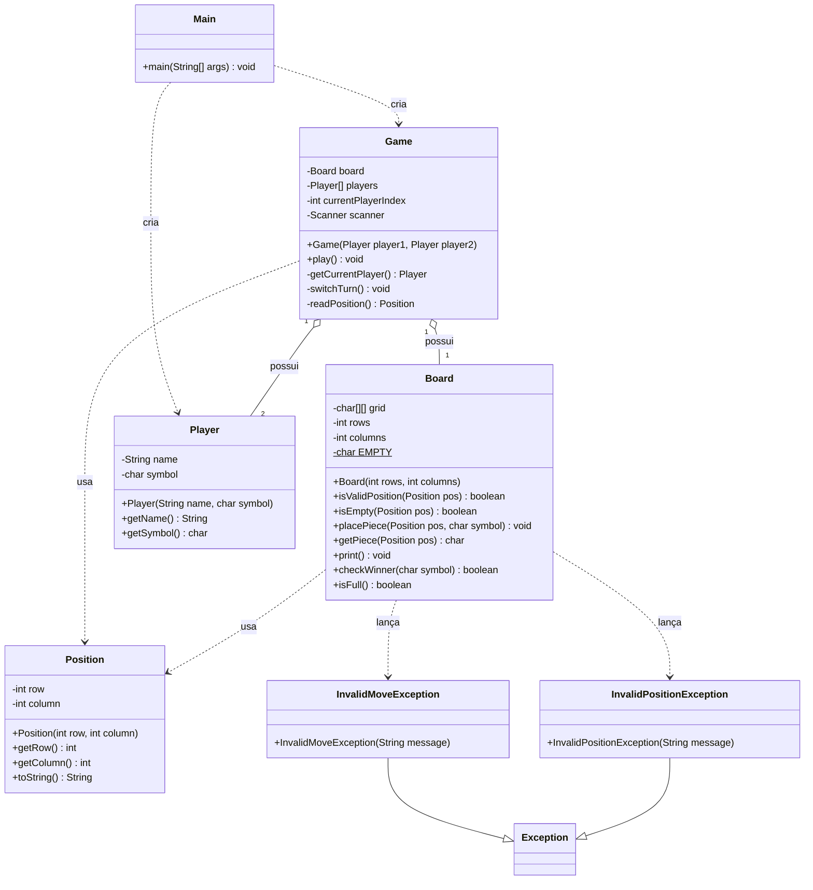

# Diagrama de Classes — Board Game Engine (Checkpoint 1)

## Leitura do diagrama

- **Main** cria dois `Player` e um `Game`, e inicia a partida chamando `play()`.
- **Game** é o controlador da partida: possui um `Board` e dois `Player` (composição — não existem fora de um `Game`), controla de quem é a vez e lê as jogadas digitadas pelo usuário.
- **Board** representa o tabuleiro e concentra as regras de posição, marcação, impressão, vitória e empate. Ele usa `Position` para localizar casas e lança `InvalidMoveException` / `InvalidPositionException` quando uma jogada é inválida.
- **Position** é um objeto simples de valor (linha e coluna).
- **Player** guarda o nome e o símbolo (`X` ou `O`) de cada jogador.
- **InvalidMoveException** e **InvalidPositionException** estendem `Exception`, criando tipos de erro próprios do jogo em vez de usar exceções genéricas.

Legenda: `o--` = composição (Game é dono de Board/Player), `..>` = dependência (uma classe usa outra), `--|>` = herança.# Diagrama de Classes — Board Game Engine (Checkpoint 1)

## Leitura do diagrama

- **Main** cria dois `Player` e um `Game`, e inicia a partida chamando `play()`.
- **Game** é o controlador da partida: possui um `Board` e dois `Player` (composição — não existem fora de um `Game`), controla de quem é a vez e lê as jogadas digitadas pelo usuário.
- **Board** representa o tabuleiro e concentra as regras de posição, marcação, impressão, vitória e empate. Ele usa `Position` para localizar casas e lança `InvalidMoveException` / `InvalidPositionException` quando uma jogada é inválida.
- **Position** é um objeto simples de valor (linha e coluna).
- **Player** guarda o nome e o símbolo (`X` ou `O`) de cada jogador.
- **InvalidMoveException** e **InvalidPositionException** estendem `Exception`, criando tipos de erro próprios do jogo em vez de usar exceções genéricas.

Legenda: `o--` = composição (Game é dono de Board/Player), `..>` = dependência (uma classe usa outra), `--|>` = herança.
